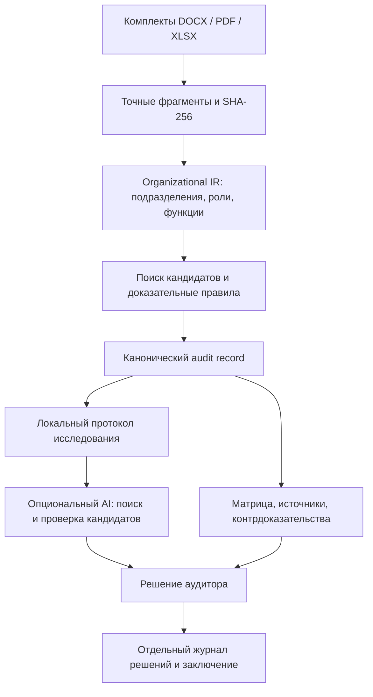

# ORG-X — The Organizational Debugger

**После реорганизации кто владеет каждой функцией — и чем это доказано?**

HackAlem AI · трек 11 Казахтелеком · «Анализ организационной структуры и функционала».

ORG-X помогает сотруднику, анализирующему организационные изменения, сопоставить комплекты документов **«до» и «после»**, проверить сохранение и передачу функций, найти потенциальные пробелы, дублирование и конфликты полномочий. У каждого вывода доступны исходные фрагменты, контраргументы и основания проверки. Аудитор принимает решение и сохраняет обоснование.

**AI proposes. Evidence proves. Human decides.** Сходство текста предлагает кандидатов; подтверждение требует проверки владельца, полномочия и контекста. Неопределённость остаётся видимой.

## Быстрый запуск для эксперта

Основной сценарий, контрольные документы и локальное расследование **работают без API-ключа, внешнего сервиса и аккаунта участника**. Интернет нужен для первоначальной установки зависимостей. Команды предназначены для macOS/Linux; на Windows используйте WSL2.

Требования: Python **3.9+** с `venv`, Node.js **22+**, pnpm **9.15.0**, Git. Проверенная конфигурация: Python 3.9.6, Node.js 22.9.0, pnpm 9.15.0. Зависимости зафиксированы в `requirements.lock` и `frontend/pnpm-lock.yaml`.

```bash
git clone https://github.com/BAITC-Hacks/hack-001016ea-intent.git
cd hack-001016ea-intent

# Если pnpm ещё не установлен:
npm install -g pnpm@9.15.0

bash scripts/setup.sh
bash scripts/check.sh
bash scripts/start.sh
```

Для уже скачанного репозитория начните с `cd` в его корень. Если репозиторий закрыт, используйте доступ, предоставленный организатором.

Откройте **http://127.0.0.1:8000**. Документация API: **http://127.0.0.1:8000/docs**. Остановка — `Ctrl+C`.

`setup.sh` устанавливает зависимости и создаёт `.env`, если его ещё нет. `check.sh` последовательно запускает тесты и production-сборку, используя временную базу и отключённый внешний AI. `start.sh` пересобирает frontend перед запуском, чтобы интерфейс соответствовал текущему коду.

<details>
<summary>Те же шаги вручную</summary>

```bash
python3 -m venv .venv
.venv/bin/python -m pip install -r requirements.lock
.venv/bin/python -m pip check
pnpm --dir frontend install --frozen-lockfile
test -f .env || cp .env.example .env
ORGX_ENABLE_OPENAI=0 .venv/bin/python -m pytest -q
pnpm --dir frontend build
.venv/bin/python -m uvicorn orgx.main:app --app-dir backend --host 127.0.0.1 --port 8000
```

</details>

## Проверка основного сценария за 5 минут

В репозитории есть **синтетический** комплект: три DOCX «до» и три «после» в [`examples/control`](examples/control). Это учебные документы ORG-X, а не документы Казахтелекома. Исходные тексты — [`sources.json`](examples/control/sources.json), генератор — [`scripts/generate_control.py`](scripts/generate_control.py).

1. На стартовом экране откройте контрольный комплект. Его также можно загрузить через «Новый аудит»: три файла `examples/control/before` в «до» и три файла `examples/control/after` в «после».
2. В **«Подразделениях»** проверьте сохранение Департамента проверки, преобразование Департамента реестров в Департамент данных и добавление Департамента контроля. Основание преобразования — явное распоряжение `after/03-order.docx`, §2.1.
3. В **матрице функций** найдите сохранённую проверку квартальной отчётности и перенесённое формирование реестра договоров. Перенос подтверждён текстом функции обеих версий и распоряжением §2.2.
4. Откройте **потенциальный пробел** проверки комплектности: исходная функция `before/02-functions.docx`, §7.2.2, и её исключение `after/03-order.docx`, §2.3. Проверьте **дублирование** сверки склада у ДД/ДК (§9.4.2 и §9.7.1) и **конфликт полномочий**: право и запрет утверждать корректировку бюджета (§9.9.1 и §9.10.1).
5. Откройте доказательства и протокол исследования. Проверьте имя документа, версию, пункт, точную цитату и контраргументы. Частичное пересечение контроля сроков и качества требует ручной проверки.
6. Сохраните решение аудитора с автором и непустым обоснованием. Скачайте **матрицу CSV**, **заключение Markdown** и **канонический JSON**. Markdown содержит решения человека; канонический JSON хранит неизменяемый системный результат. Повторный анализ того же комплекта возвращает тот же ID и результат из кэша.

Риски — основания для проверки, а не утверждения о нарушениях. Контрольный комплект проверяет известные сценарии; он не доказывает точность на произвольных документах.

## Реальные документы организатора

В локальной разработке использованы `Внутренний_аудит_редакция_8_до.docx`, `Внутренний_аудит_редакция_9_после.docx` и описание трека `track_11.txt`.

Оригинальные файлы **не включены в Git**. Полученные у организатора DOCX загрузите через интерфейс. Для кнопки реальной пары, source-тестов и benchmark поместите оба DOCX с указанными именами в `work/hackalem/kazakhtelecom/`. Текст задания при наличии хранится в `work/hackalem/docs/track_11.txt`; для запуска он не нужен.

Сценарий демонстрации реальной пары:

- В перечне §3.4 **ДНМ и ДККМ сохранены**, ДИТААД и ДОА добавлены. Изменение ролей §5.3 рассматривается отдельно: вывод «два департамента заменены четырьмя» не делается.
- Взаимодействие с субъектами СВК перенесено из §5.4.4/а–б «до» в §5.3.3/а–б «после». Ответственный указан коллективно; исключительный владелец не выдумывается.
- Прежнее право формировать группы контроля качества (§5.6.2 «до») рассматривается вместе с контраргументами §5.5.2 и §10.7 «после». Потенциальный пробел явного полномочия не означает потерю всей функции контроля качества.
- Участие в органах управления (§4.4 «после») сопоставляется с ограничением управленческих решений (§5.8.1/в) и мерами независимости. Это потенциальный риск, требующий проверки.

[`truth/source_truth.json`](truth/source_truth.json) содержит 22 авторских контрольных случая, исходные цитаты и SHA-256. Runtime не читает этот файл. Независимая экспертная приёмка не проводилась: `human_signoff=null`. Подробнее — [`truth/README.md`](truth/README.md).

## Архитектура и технологии



- **Backend:** Python, FastAPI, Uvicorn, Pydantic; SQLite хранит результаты, кэш и решения аудитора.
- **Извлечение:** `python-docx` для DOCX, PyMuPDF для текстового PDF, openpyxl для XLSX. Исходные фрагменты сохраняются отдельно от интерпретации.
- **Сопоставление:** детерминированный поиск, явные владельцы, модальность `duty/right/prohibition`, контекст и проверяемые правила. Similarity не является вероятностью правильного вывода.
- **Frontend:** React 19, TypeScript, Vite, Tailwind CSS, Lucide.
- **AI:** опциональный OpenAI Responses API с ограниченным циклом вызова инструментов. Модель предлагает кандидатов; не меняет системные факты.
- **Проверки:** pytest, API TestClient, синтетические/adversarial кейсы, контрольные цитаты реальных документов, TypeScript и production-сборка.

Карта репозитория:

```text
backend/orgx/        ingestion, IR, правила, API, investigator, SQLite
backend/tests/      API, источники, устойчивость и негативные сценарии
frontend/src/       рабочее место аудитора
examples/control/  воспроизводимый синтетический комплект 3 + 3 DOCX
truth/              контрольная разметка реальной пары
scripts/            установка, проверка, запуск, генератор и benchmark
docs/               архитектура, результаты проверки, сторонние компоненты
work/               локальная база и документы; исключены из Git
```

Описание модулей, API и доказательной политики — [`docs/architecture.md`](docs/architecture.md). Результаты выполненных проверок — [`docs/validation.md`](docs/validation.md).

### История ответственности и семь проверок

Экран организационных проверок показывает ответственность, её владельцев в обеих версиях, кандидатов и цепочку источников. Для каждой записи выполняются проверки: непрерывность владельца, основание передачи, границы ответственности, конкурирующие владельцы, совместимость полномочий, разделение/объединение и целостность источников.

`R-ID` — fingerprint нормализованных action/object/context/authority. Он не зависит от номера пункта, версии и отдельного поля владельца; перефразирование может изменить ID. Совпавший fingerprint сам по себе не доказывает эквивалентность. `lineage_id` различает конкретные вхождения и сохраняет ссылки на документы. Документарные риски вне извлечённых функций отображаются отдельными записями.

`PASS` означает выполнение указанного документарного условия. `REVIEW` требует проверки; повреждённая доказательная цепочка отклоняется валидатором. `SPLIT`/`MERGED` допускаются только как гипотезы полного буквального покрытия частей при совместимых контексте и полномочиях; это не подтверждённое правопреемство.

Кнопка локального расследования выполняет поиск, проверку кандидатов, поиск контрдоказательств и пересмотр рабочей гипотезы. Журнал отражает выполненные операции. Это детерминированный workflow без LLM; отдельное AI-исследование описано ниже. На реальной паре показываются её фактические результаты — наличие split/merge не выдумывается ради демонстрации.

Модель истории, условия проверок и API — [`docs/debugger.md`](docs/debugger.md).

## Окружение, данные и AI

Настройки читаются из `.env` в корне; пример — [`.env.example`](.env.example). Заданные переменные процесса имеют приоритет.

- `ORGX_ENABLE_OPENAI=0` — внешний AI отключён; `1` разрешает опциональные AI-действия интерфейса.
- `OPENAI_API_KEY` — ключ только на backend, нужен исключительно для внешнего AI.
- `OPENAI_MODEL` — модель/snapshot, доступные аккаунту; автоматической подмены нет.
- `ORGX_DB` — путь SQLite. По умолчанию `work/orgx.sqlite` внутри проекта; относительный пользовательский путь считается от рабочей директории процесса.
- `PORT=8000` — порт скрипта запуска. Например: `PORT=8010 bash scripts/start.sh`. Передаётся в shell; файл `.env` не задаёт порт Uvicorn.

Загрузка, анализ, источники, локальная проверка и экспорт работают локально. SQLite содержит извлечённые тексты, результаты и решения; `.env` и `work/` исключены из Git. Для отдельной базы: `ORGX_DB=work/test.sqlite bash scripts/start.sh`.

При включённом AI отдельное действие интерфейса отправляет выбранные функции, контекст и запрошенные фрагменты в OpenAI. `investigator.py` предоставляет инструменты `search_evidence`, `inspect_claim`, `propose_pair`; модель может выбрать следующий поиск и изменить кандидатов. Лимит — 8 раундов и 10 инструментальных вызовов. Перед предложением пары обязательны поиск в обеих версиях, отдельный поиск контрдоказательств в версии «после», просмотр обеих функций и проверка допустимых source ID.

Вызовы и результаты сохраняются отдельно. Неизвестные инструменты/ID отклоняются; отсутствие ключа, ошибка сервиса или лимит не отменяют локальный аудит. Непроверенный текст модели не становится доказательством. Пакетный адаптер `llm.py` отдельно предлагает ID соответствий. Кэш учитывает запрос, версию протокола и модель. Новые ответы внешней модели не обещаются детерминированными; канонический record не зависит от них.

Приложение рассчитано на одного локального аудитора и слушает `127.0.0.1`. Многопользовательская авторизация и сетевое развёртывание в MVP не входят.

## Тестирование и воспроизводимость

```bash
# Тесты + TypeScript + production-сборка, последовательно:
bash scripts/check.sh

# Проверки устойчивости без документов организатора:
.venv/bin/python -m pytest -q backend/tests/test_robustness.py -m 'not source_documents'

# Benchmark реальной пары, если её DOCX помещены в work/:
ORGX_ENABLE_OPENAI=0 .venv/bin/python scripts/benchmark.py
```

Без оригиналов организатора source-тесты выводят **SKIPPED**: это отсутствие проверки реальной пары, а не успешная приёмка её результатов. Синтетический комплект поставляется с кодом и работает на чистом клоне. Внешний AI в автоматических тестах заменён fake-клиентом: платные API-вызовы не нужны.

Проверяются точные цитаты и хэши, устойчивость к перенумерации, отрицанию и числовым условиям, неизвестный/конкурирующий владелец, сужение контекста, форматы файлов, ошибки API, порядок комплектов, кэш и сохранение решений. Повторные входные байты и имена при тех же версиях движка/политики дают одинаковый канонический JSON. Решение аудитора не переписывает исходный анализ.

## Ограничения и интерпретация

- Парсер распознаёт явные списки подразделений, заголовки функций/прав/обязанностей и поддерживаемые распорядительные формулировки. Нестандартная структура, синонимы и перефразирование могут требовать ручной проверки; универсальное извлечение всех функций не заявляется.
- `action/object/scope/authority` основаны на тексте и структуре, а не на полной семантической онтологии. Пустой scope не означает неограниченную ответственность. Некоторые правила специализированы для положений внутреннего аудита.
- Отсутствие совпадения не доказывает потерю функции. Точное совпадение без проверки владельца, модальности и контекста не доказывает сохранение. Новые дубли проверяются и без предшественника; смысловые дубли с другими формулировками могут быть пропущены.
- DOCX: основной текст и таблицы; без OCR, колонтитулов, сносок и вложенных файлов. Исправления Word требуют принятия/отклонения перед повторным анализом. PDF: текстовые блоки и страницы, порядок чтения требует проверки; сканы без текста отклоняются. XLSX: текст/формулы и координаты ячеек, без вычисления формул. Старые `.doc`/`.xls` не поддерживаются.
- Лимиты: **8 файлов на версию**, **20 МБ на файл**, **40 МБ на комплект**, **100 МБ распакованного DOCX/XLSX**, **12 000 фрагментов** на комплект и **1 500 функций**. Повтор одного файла внутри версии отклоняется.
- Риски требуют решения ответственного сотрудника. Проверка законодательства, сравнение с другими операторами, доказательство фактического конфликта интересов и автоматическое перераспределение ответственности не реализованы.

## Если запуск не получился

- **Не найден python3/pnpm:** установите версии из требований; на Linux может понадобиться `python3-venv`.
- **Ошибка установки:** проверьте доступ к PyPI/npm и свободное место; повторите `bash scripts/setup.sh`. Существующий `.env` сохраняется.
- **Порт занят:** остановите старый экземпляр или выполните `PORT=8010 bash scripts/start.sh`.
- **Нет реальной пары:** используйте контрольный комплект или загрузку файлов; оригиналы в Git не входят.
- **HTTP 422:** проверьте формат, лимиты, отсутствие повторов и наличие текста. Для сканированного PDF нужен предварительный OCR вне ORG-X.
- **HTTP 507:** проверьте свободное место и право записи в каталог SQLite.
- **AI отключён/нет ключа:** штатный режим; основной сценарий доступен.

Для разработки: backend на 8000 и отдельно `pnpm --dir frontend dev`. Vite проксирует `/api` на 8000; произвольный `PORT` этот proxy не меняет.

## Источники и сторонние компоненты

Задание: [страница HackAlem AI](https://edu.astanahub.com/hackathons/df4743f5-c492-415c-b45a-1f13adb78e06), «Треки», задача 11 Казахтелекома. [Положение](https://edu.astanahub.com/hackathons/df4743f5-c492-415c-b45a-1f13adb78e06?tab=regulations), §5.4.15 и §5.6.4–6: самостоятельный запуск, документация и проверка без личных аккаунтов команды.

Библиотеки и лицензии — [`docs/third-party.md`](docs/third-party.md); версии — в lock-файлах. При разработке, анализе и тестировании использован OpenAI Codex. Контрольные документы синтетические; источники организатора и авторская разметка обозначены отдельно. Обучение собственной модели не выполняется. Лицензия исходных документов организатора не заменяется лицензиями программных компонентов.
