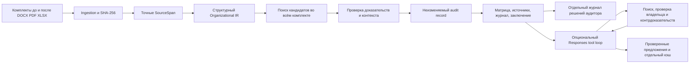

# Архитектура ORG-X

FastAPI обслуживает API и production-сборку React/TypeScript/Vite/Tailwind. SQLite хранит неизменяемые артефакты, кэши и отдельный журнал решений. Все пути по умолчанию относительны корню репозитория.

## Движение данных

AI-кандидаты не имеют ребра к каноническим выводам. Интерфейс показывает сами пары, исходные фрагменты и реально выполненные действия инструментов. Свободный текст модели не превращается в доказательство. Локальный протокол проверок и внешнее AI-исследование обозначены отдельно.

## Модули

- `models.py`: строгие Pydantic-схемы документов, цитат, владельцев, функций, поиска, выводов, матрицы и журнала. Коллективная роль отличается от департамента.
- `ingest.py`: точный текст, физический `paragraph_id`, section/clause, SHA-256 и ограничения форматов. Нормализация применяется только для сравнения; исходная цитата не заменяется нормализованным текстом. OCR отсутствует.
- `corpus.py`: стабильный порядок комплектов, запрет повторов одинакового содержимого в одной версии, объединение явно одинаковых владельцев внутри версии. Ссылки сохраняют реальный document ID. Корпус не подменяет отдельные документы одним вымышленным файлом.
- `extract.py`: явные списки подразделений и заголовки ответственности. Разделы определяются по названиям, вложенность — по структуре пунктов. Конкретные номера не назначают владельца. Поддерживаются названия функций, прав и обязанностей, перечисленные в парсере, включая семейство исходных положений. Это ограниченный структурный парсер, не универсальная семантическая онтология. `scope/context_text` сохраняют исходные уточнения, а не имя владельца. Пустой scope не доказывает универсальную область ответственности. Все заголовки, использованные для назначения владельца, сохраняются как источники.
- `retrieval.py`: полный поиск по извлечённым spans выбранной версии, лексические и символьные кандидаты. Журнал содержит manifest всех просмотренных документов и фрагментов, найденные IDs, число точных совпадений и ограничение метода. Обратный поиск используется для новых функций без предшественника.
- `engine.py`: воспроизводимые доказательные правила. Правила исходного семейства проверяют текст, владельца и структурную принадлежность; номера остаются только локаторами. Для подтверждённого переноса нужны однозначность, полномочие, контекст и прямое основание. Никакой порог similarity не создаёт факт.
- `rules.py`: явные распорядительные формулы о передаче, исключении функции и преобразовании подразделения; проверка совпадения функции, владельцев и перечней. Дополнительно сравниваются функции новой версии между собой, включая функции без старого предшественника. Полное совпадение обязанностей у независимых владельцев даёт возможное дублирование; частичное пересечение остаётся ручной проверкой. Разрешение и запрет в сопоставимом scope дают риск конфликта. Эти сигналы не устанавливают нарушение.
- `report.py`: матрица всех извлечённых функций до и после, воспроизводимый протокол выполненных проверок, рекомендации с источниками. Число функций отделено от числа рисков. CSV защищён от интерпретации исходного текста как формулы. Markdown-заключение включает источники и отдельные решения человека.
- `store.py`: canonical JSON, SQLite WAL, immutable insert и закрытие соединений. Канонический record не содержит текущего времени. Автор, дата и решение аудитора живут отдельно.
- `llm.py`: опциональное пакетное предложение кандидатов, строгая schema, проверка ID, кэш и fallback.
- `investigator.py`: ограниченный цикл Responses API. Модель выбирает запросы и вызывает только `search_evidence`, `inspect_claim`, `propose_pair`. Предложение допускается после поиска обеих версий, отдельного поиска контрдоказательств в новой версии и проверки обоих владельцев. Все ссылки проверяются. Максимум 10 действий инструментов и 8 раундов; timeout запроса 15 секунд, без автоматических повторов. Ошибка возвращает безопасный fallback. Запрос и ответы сохранены в отдельном кэше; публичный ответ содержит фактический журнал действий и кандидатов, без сырого рассуждения. Указанная пользователем модель не подменяется.
- `main.py`: повторяемые multipart-поля `before/after`, демо, чтение, экспорт, review, предложения и исследования. До 8 файлов на версию, 20 МБ на файл, 40 МБ суммарно, 12 000 spans и 1 500 извлечённых функций. Повтор одинакового файла в одной версии отклоняется.
- `frontend/src`: обзор, подразделения, функции, матрица с поиском/пагинацией/CSV, заключение с рекомендациями, точные источники с соседними абзацами из правильного документа, журнал исследования и решение аудитора.

Цикл инструментов следует [официальной схеме Responses function calling](https://developers.openai.com/api/docs/guides/function-calling): ответы модели и результаты инструментов возвращаются следующему раунду. При `store=false` зашифрованные reasoning items можно передавать между раундами; их содержание не отображается как журнал действий.

## API

- `GET /api/health`: backend, версия движка, наличие оригинального демо и флаг AI.
- `POST /api/audits`: multipart `before`, `after`, по 1–8 файлов; возвращает record и признак cache hit. Имя файла не используется как путь записи.
- `POST /api/demo`: обработка локальной исходной пары редакций 8/9. Нет подмены результатами truth set.
- `POST /api/demo/synthetic`: обработка шести файлов из `examples/control`, доступных в репозитории без приватных источников и аккаунтов.
- `GET /api/audits/{id}` и `/export`: сохранённый канонический audit JSON.
- `GET /api/audits/{id}/matrix.csv`: матрица функций и ссылок.
- `GET /api/audits/{id}/report.md`: заключение с точными источниками и отдельными последними решениями аудитора.
- `GET /api/audits/{id}/reviews`: полный упорядоченный журнал решений.
- `POST /api/audits/{id}/findings/{finding_id}/review`: `status`, `actor`, `note`. Допустимы `ACCEPTED`, `REJECTED`, `NEEDS_INFO`; непустое обоснование обязательно. Указанное пользователем имя не является проверенной личностью или криптографической подписью.
- `POST /api/audits/{id}/suggestions`: пакетные AI-кандидаты.
- `POST /api/audits/{id}/findings/{finding_id}/investigate`: AI-исследование конкретного вывода; при отключённом AI доступен локальный протокол.

## Воспроизводимость

Одинаковые байты, имена файлов и версии engine/policy дают одинаковый JSON независимо от порядка файлов в загрузке. Порядок findings и кандидатов стабилен. Изменение правил требует повышения версии, чтобы не переиспользовать старый кэш. Старые record и решения человека не переписываются.

Перенумерация меняет байты, хэши и ID record. Тесты сравнивают типы выводов и физические позиции доказательств, а не требуют одинаковых JSON для разных документов. Сходство и fingerprints не доказывают семантическую эквивалентность.

Replay AI использует сохранённые запросы и ответы. Очистка AI-кэша может изменить предложения модели, но не канонический аудит. Свежая генерация не объявляется детерминированной.

## Границы доказательств

`PRESERVED` подтверждает текстовую обязанность в извлечённом контексте, а не фактическое исполнение. `NEW` означает появление в сопоставимых перечнях, а не дату создания. `MOVED` подтверждает текстовое перераспределение, не юридическое правопреемство. `REORGANIZED` требует прямого распорядительного основания; простое исчезновение и появление названий его не заменяет.

`POTENTIAL_*` — сигнал риска с источниками и альтернативами. Неизвестный владелец, частичное покрытие, перефразирование без проверенной эквивалентности и несколько кандидатов требуют человека. Лексический поиск не доказывает семантическое отсутствие. Для новых пересечений без предшественника показывается реальный поиск по старому комплекту; старая функция не выдумывается.

На исходной паре ДНМ и ДККМ сохранены в перечне, ДИТААД и ДОА добавлены. Четыре подразделения не объявляются заменой двух. Контрольный комплект синтетический и явно маркирован; он не описывает Казахтелеком. `human_signoff=null`: независимая экспертная приёмка не проведена.

## Производительность и локальность

Документы извлекаются один раз и кэшируются по содержимому, имени, версии и версии движка. Поиск выполняется пакетно, без LLM-вызова на каждую функцию. Время не входит в audit record. `scripts/benchmark.py` измеряет cold/warm API отдельно; исторические замеры не являются SLA.

База и документы локальны. Передача фрагментов в OpenAI происходит только при включённом адаптере и явном запуске пользователем соответствующей операции; интерфейс объясняет передачу. Основной сценарий и синтетическое демо работают без ключа API.

## Проверки ответственности

С версии `orgx-2.1.0` / `evidence-policy-2.1.0` отдельный слой добавляет fingerprints, историю сопоставлений и семь организационных проверок. Повреждённая цепочка цитат отклоняется валидатором. `PASS` означает выполнение конкретного документарного условия, а не юридическую или экспертную приёмку. SPLIT/MERGED являются только `COMPOSITION_HYPOTHESIS` и всегда требуют человека.

`GET /api/audits/{id}/organizational-tests` возвращает записи и проверки; `POST /api/audits/{id}/responsibility-investigation` с `lineage_id` выполняет локальное исследование с возможностью пересмотра гипотезы. Оно отдельно обозначено как детерминированное, сохраняет канонические выводы и не обращается к модели. Подробности и границы — в [debugger.md](debugger.md).
