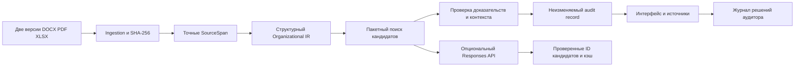

# Архитектура ORG-X

FastAPI обслуживает API и production-сборку React/TypeScript/Vite/Tailwind. SQLite хранит неизменяемые артефакты, кэши и отдельный журнал решений. Все пути по умолчанию относительны корню репозитория.

## Движение данных

AI-кандидаты намеренно не имеют ребра к итоговым фактам: это предложения для дальнейшей проверки. Они доступны по API и как число предложений в интерфейсе; произвольные объяснения модели не выводятся как доказательства.

## Модули

- `backend/orgx/models.py`: строгие Pydantic-схемы Document, SourceSpan, Unit, FunctionClaim, MatchCandidate, SearchResult, Finding, AuditRecord. Коллективная роль отличается от департамента.
- `ingest.py`: exact text, физический `paragraph_id`, section/clause, SHA-256 и ограничения форматов. Нормализация используется только для сравнения; исходная цитата не заменяется нормализованным текстом.
- `extract.py`: явные списки подразделений и заголовки ответственности. Модальность `duty/right/prohibition` наследуется от структурного контекста. `action/object` — синтаксическое разбиение исходного текста, не семантическая онтология; родительская формулировка и заголовок сохранены как доказательства.
- `engine.py`: поиск по всем извлечённым spans «после», top-5 лексических кандидатов плюс все точные совпадения, детерминированные доказательные правила. Никакой порог similarity не создаёт финального факта. Версии движка и политики входят в ID record.
- `store.py`: canonical JSON (`sort_keys`, фиксированные разделители), SQLite WAL и immutable insert. В record нет времени выполнения и текущей даты. Время и автор human review живут в отдельном журнале.
- `llm.py`: feature flag, ограниченный пакет, строгая schema, проверка принадлежности пар к отправленному IR, content-addressed кэш, versioned prompts, fallback. Указанная пользователем модель не подменяется.
- `main.py`: загрузка, демо, получение record, export, review и suggestions.
- `frontend/src`: обзор, сравнение подразделений, фильтруемые функции, текстовое заключение, панель источников с соседними абзацами и human review.

## API

- `GET /api/health`: состояние backend, наличие демо и флаг AI.
- `POST /api/audits`: multipart `before`, `after`; возвращает record и признак cache hit. Имя файла не используется как путь записи.
- `POST /api/demo`: те же ingestion/extraction/rules на двух локальных файлах, без подмены результатом из truth set.
- `GET /api/audits/{id}`: сохранённый audit record.
- `GET /api/audits/{id}/export`: канонический JSON; решения человека экспортируются отдельно через reviews API.
- `GET /api/audits/{id}/reviews`: упорядоченный журнал решений.
- `POST /api/audits/{id}/findings/{finding_id}/review`: `status`, `actor`, `note`. Допустимы `ACCEPTED`, `REJECTED`, `NEEDS_INFO`; непустое обоснование обязательно. Это локальный журнал с указанным пользователем именем, не криптографическая подпись и не проверенная личность.
- `POST /api/audits/{id}/suggestions`: только опциональные AI-кандидаты, не изменение record.

## Что означает воспроизводимость

Одинаковые байты и имена двух входов плюс одинаковые версии extraction/engine/policy дают одинаковый JSON. Порядок findings и кандидатов стабилен, similarity не использует рандом. Важное изменение правил требует повышения `ENGINE_VERSION` или `POLICY_VERSION`, чтобы не переиспользовать старый кэш.

Replay AI использует сохранённый запрос и ответ. Очистка AI-кэша может дать другой набор предложений модели, но не другой канонический аудит. Нельзя называть свежую генерацию детерминированной только из-за параметров sampling.

## Границы доказательств

`PRESERVED` подтверждает текстовую обязанность в извлечённом контексте, а не её фактическое исполнение. `NEW` означает появление в сопоставимых перечнях. `MOVED` подтверждает текстовое перераспределение, не юридическое правопреемство.

`POTENTIAL_*` — сигнал риска с источниками и альтернативами; ни один из них не утверждает нарушение. При неизвестном владельце, частичном покрытии, перефразировании без проверенной эквивалентности или нескольких кандидатах вывод остаётся `REQUIRES_HUMAN_REVIEW`.

Полный лексический поиск не доказывает семантическое отсутствие. В его журнал входят query, manifest всех searched span IDs, кандидаты, число точных совпадений и ограничение метода. Точный поиск отдельного полномочия используется только вместе с явным старым пунктом и контраргументами новой версии.

## Производительность и локальность

Документы извлекаются один раз и кэшируются по содержимому, имени, версии и версии движка. Токены всех новых claims и spans вычисляются одним проходом. Пакетное сопоставление выполняется локально без LLM-вызова на каждый пункт. Кэш запроса ссылается на один canonical record, не дублирует его JSON.

Проверка реальной пары занимает практичное для демонстрации время; `scripts/benchmark.py` измеряет cold/warm API отдельно. Числа времени не входят в audit record. База и исходники локальны, кроме явно включённого и вызванного AI-адаптера.
