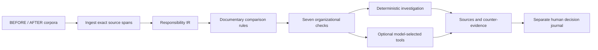

# ORG-X — The Organizational Debugger

Documents are inputs, responsibility claims are a typed intermediate model, and documentary continuity is a set of checkable predicates. ORG-X preserves exact evidence and human review even when the system cannot establish a relationship.

The existing compiler (`ingest.py` / `extract.py`), comparison rules, truth expectations and human-review store are retained. Debugger enrichment adds fields to the canonical record; it does not rewrite existing findings or allow a model to decide their status.

## Identity and lineage

`R-…` is a SHA-256-derived fingerprint of normalized action, object, explicit parent context and authority. It excludes document bytes, version, paragraph address and owner, so pure renumbering, whitespace and a change of owner do not automatically change the fingerprint. Ownership lives on individual source-backed claim occurrences.

A shared fingerprint is **not proof of functional equivalence**. An unchanged text with a different owner remains `UNKNOWN` unless a documentary rule establishes the transfer. Different scope, authority, action or substantive wording changes the fingerprint. Semantic paraphrases are not silently assigned an old identity. Cross-audit equivalence adjudication and a human-maintained identity registry are not implemented.

`lineage_id` identifies one occurrence in an audit and is not promised to survive source-file changes. Each lineage includes before IDs, established successors or composition candidates, source IDs, existing finding IDs, `basis`, and a human-review requirement. `DOCUMENTARY_RULE` and `COMPOSITION_HYPOTHESIS` must not be presented as equally established facts. Separate `E-…` records retain documentary risks outside extracted duty blocks.

## Seven organizational tests

Each record is checked for owner continuity, transfer evidence, scope continuity, duplicate ownership, authority compatibility, split/merge, and source integrity.

`PASS` means the stated documentary predicate is satisfied. `REVIEW` preserves insufficient or competing evidence. `NOT_APPLICABLE` avoids inventing a transfer when the owner is unchanged. Integrity violations raise a validation error and are not published as valid findings. Counts distinguish checks from records; one responsibility can have multiple source occurrences and risks.

The source validator checks exact claim text against its primary source span, document/version membership, unique source and claim IDs, full search manifests, candidate directions, and evidence references. Source spans serialize exact `text_hash` and normalized `content_hash`; deserialization rejects a mismatched supplied hash. The original document SHA-256 remains separate. Hashes establish payload consistency, not external authenticity of the uploaded document.

## Real local investigation

`POST /api/audits/{id}/responsibility-investigation` with `{"lineage_id":"…"}` executes the local workflow on demand:

1. Form a provisional hypothesis and inspect the old claim/owner.
2. Search all extracted spans in the relevant version.
3. Compare candidates by action, explicit context and authority. Reject mismatches; retain partial candidates.
4. Search competing owners and counter-evidence across the after claims and include the original rule's counterarguments.
5. Recompute a composition hypothesis and revise the initial hypothesis if supported.
6. Request human review and return the actual sequence of operations and source IDs.

This workflow is explicitly labelled `deterministic_investigation`. It is not described as an LLM choosing tools. The optional model-driven investigation in `investigator.py` is a separate bounded tool loop; its output remains proposals and has its own replay cache.

### Split and merge limits

Only flat literal conjunctions are decomposed. For example, “Контролирует полноту реестра оборудования и полноту журнала платежей” can be covered by two separate claims beginning with the same action and covering those exact objects. Full, non-overlapping coverage, compatible authority/context and explicit owners are required. Competing coverage blocks the proposed classification. These are `SPLIT` / `MERGED` **hypotheses**, always requiring review. No broad/narrow, inflection or synonym equivalence is inferred. A real document is never rewritten to manufacture this example.

## UI and API

The Organizational Tests screen presents records → seven checks → investigation → source fragments → the existing finding/review drawer. It opens by default after analysis. Existing overview, matrix, unit changes and conclusion views remain available.

- `GET /api/audits/{id}/organizational-tests` returns responsibilities, checks and summary.
- `POST /api/audits/{id}/responsibility-investigation` performs a local investigation, without network requests or canonical mutation.
- Existing finding-level AI and review routes continue to serve their separate purposes.

For the real REV8/REV9 demo, run the existing real-document endpoint, select the potential gap for the explicit quality-control-group right, inspect the before owner, run INVESTIGATE, inspect rejected/partial candidates and counter-evidence, and open the original source fragments. Also show the two documentary transfers and the governance/independence risk. Do not describe those real cases as an established split or a confirmed organizational loss.

Engineering controls are in `backend/tests/test_organizational_debugger.py`, through real DOCX ingestion plus API and provenance-tampering tests. They do not constitute independent expert signoff.
